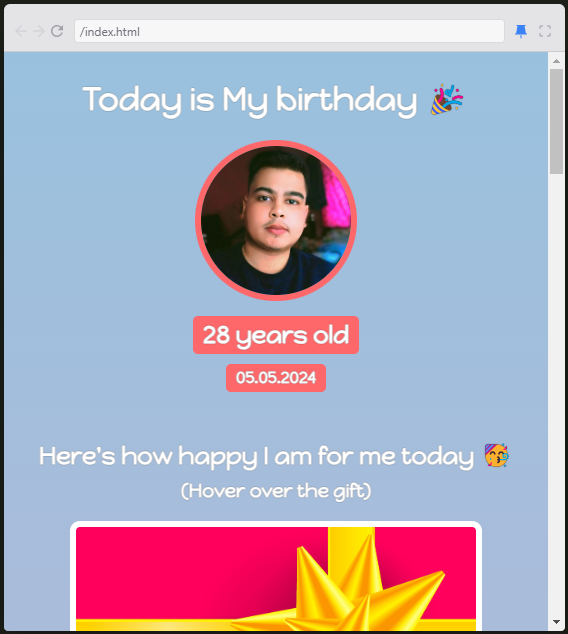

# 🎉 Birthday Gift Website 🎂  
A fun and interactive **birthday gift website** made with **HTML and CSS** to celebrate someone's special day in a unique way! 🎁✨  

## 🎨 Features  
- **Beautiful & Personalized Design** – Custom birthday message and styling.  
- **Profile Picture Display** – Showcases the birthday person's photo.  
- **Fun Surprise Effect** – Interactive hover effect on the gift.  
- **Mobile-Friendly** – Fully responsive layout for all devices.  

## 🛠️ Technologies Used  
- **HTML** – For structuring the webpage.  
- **CSS** – For styling and animations.  

## 📸 Preview  
Here's how the birthday gift website looks:  
  
  

## 🚀 Getting Started  
1. **Clone the repository:**  
   ```bash
   git clone https://github.com/SaketXPrasad/birthday-gift-site.git  
   ```  
2. **Navigate into the project folder:**  
   ```bash
   cd birthday-gift-website  
   ```  
3. **Open the website in your browser:**  
   ```bash
   open index.html  
   ```  

## 🎁 Customization  
- Change **text and emojis** in `index.html`.  
- Replace **profile picture** with a custom image.  
- Modify **colors and fonts** in the CSS file to match the birthday person's personality.  

## 💡 Future Enhancements  
- **Add Background Music** – Play a birthday song automatically.  
- **Include Confetti Animation** – Make the page more festive.  
- **Personalized Messages** – Allow users to input their own birthday wishes.  

## 🙌 Contributions  
Want to improve this project? Feel free to fork the repo, submit pull requests, or suggest new features!  

## 📩 Contact  
**Project Maintainer:** Saket Prasad  
**Email:** saketxprasad@gmail.com  

🎂 **Thank you for checking out this project! Hope this brings joy to someone's birthday!** 🎊  
